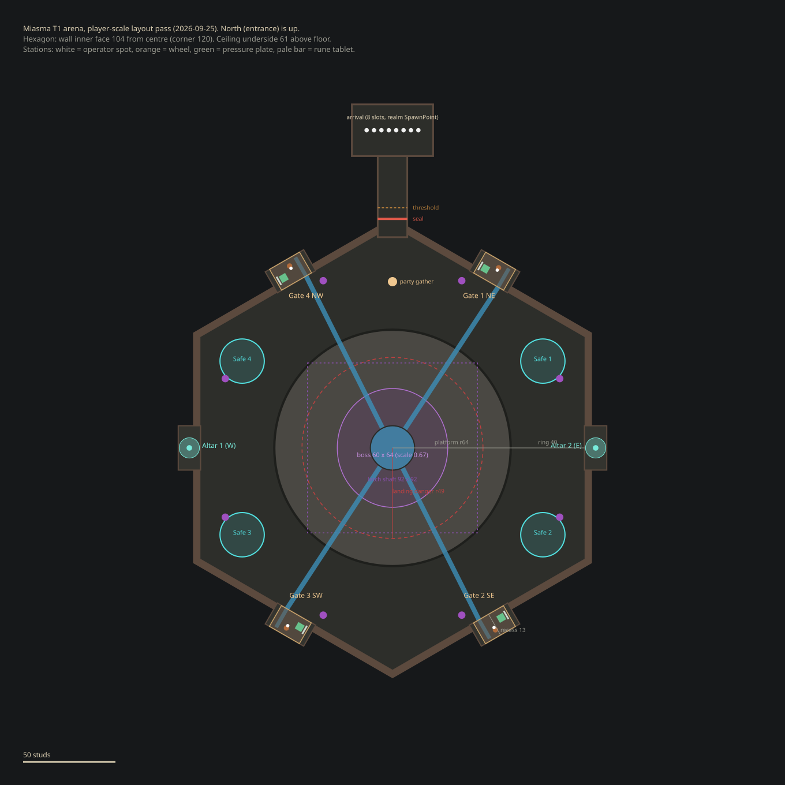

# Miasma Boss Arena and Encounter

This document is the source of truth for the Tier 1 Miasma arena, encounter
flow, mechanics, assets, and implementation boundaries. Follow
[Dungeon Creation Workflow](./dungeon-creation-workflow.md) for the reusable
environment pipeline.

## Implementation checkpoints

Complete and review each checkpoint before beginning the next one:

1. Write and cross-check the master documents.
2. Finish the Blender gameplay structure.
3. Finish arena dressing and collision proxies.
4. Export and playtest the untextured Studio graybox.
5. Implement encounter lifecycle and cleanup.
6. Implement Act 1, poison, and cleansing.
7. Implement gates and the valve maze.
8. Implement Miasma's active combat moves and damage cycles.
9. Implement enrage and encounter completion.
10. Author and integrate animation and VFX.
11. Apply materials and finish the environment.
12. Run the integrated acceptance pass.

At each checkpoint, report the changed files or Blender artifacts and the exact
test the user needs to perform. The user performs fresh-session Studio playtests.

### Implementation status (2026-09-21)

| Checkpoint | Status | Current handoff |
| ---: | --- | --- |
| 1 | Complete | Both master documents exist and are indexed in `AGENTS.md`. |
| 2 | Complete for graybox | Stage 11 contains the encounter structure in named collections. |
| 3 | Complete for graybox | Stage 12 contains dressing, anchors, and collision proxies. |
| 4 | Superseded by the player-scale layout pass (2026-09-25) | The oversized Blender graybox was retired from the realm template (kept in `ServerStorage.MiasmaArenaBackups`). The arena is now a Studio-primitive layout built from `RS/MiasmaArenaLayout`; see [Player-scale layout](#player-scale-layout-2026-09-25). It is the candidate specification for the next Blender pass. |
| 5 | Implemented locally | Realm-scoped lifecycle, entry, sealing, failure, victory, and cleanup are ready for Studio validation. |
| 6 | Implemented locally | Act 1, slime waves, poison, cleansing, boss drop, and cistern indicator are ready for Studio validation. |
| 7 | Implemented locally | Four physical valve stations (primitive MVP art), world-only rune tablets, the cursor maze UI, server-validated maze sessions, channel water, timeout purge, pure-water stun, and resets are ready for Studio validation. See [Valve stations and the maze](#valve-stations-and-the-maze). |
| 8 | Implemented locally | Contextual projectile, scatter, submerge, persistent hazards, and sack thresholds are ready for Studio validation. |
| 9 | Implemented locally | Locked-threshold enrage and encounter-owned completion are ready for Studio validation. |
| 10 | Awaiting asset publication | Nine reviewed first-pass FBXs and source VFX exist. Published IDs and in-game animation/VFX review are still required. Defeat playback remains deferred until its delayed death presentation is approved. |
| 11 | Material library ready | Six PBR sets and a packed Blender library exist. Arena UV assignment, Studio MaterialVariants, lighting, water, fog, and final dressing remain. |
| 12 | Pending | Full solo, four-player, and eight-player acceptance requires Studio playtests. |

The encounter source has passed Rojo build, Luau syntax compilation in Studio
Edit mode, controller construction/teardown smoke testing, and pure-logic
formula/maze assertions. These checks do not establish gameplay balance,
network feel, collision, visual readability, or performance in a live server.

### Testing the valve station without a dungeon run

`SSS/MiasmaValveDevHarness` (Studio sessions only) builds one real station at
`Workspace.MiasmaValveDev.ValveStation`, standing in the master template's
Northwest recess, and runs it through the real gate, maze and remote code in a
loop. A lantern post beside the T1 portal (`Travel`) takes you there; the post at
the station offers `Return` and `Reset Station`. Set the folder's `PartySize`
attribute (1 to 8) in the Server view to test the larger workloads, or
`SpawnClogs = false` to skip the clogs.

### Starting the current T1 test dungeon

`DungeonPortalConfig` maps the **Miasma's Blighted Aqueducts** T1 entry to
`Workspace.DungeonRealmTemplate` and the `Miasma` encounter. The entry flow
does not send players into the editable master template. It clones that model
under `Workspace.DungeonInstances`, moves the clone to an isolated same-server
location, and teleports the accepted party to the clone's `SpawnPoint`.

Use this fresh-session Studio test flow:

1. Sync Rojo, then start a new play session.
2. Press **F10** to open `ItemGrantDevMenu` and grant one **T1 Dungeon Key**.
3. Travel to the runtime-created `Workspace.DungeonPortals.T1Portal` at
   approximately `(-1160, 8.5, 60)` and walk into it.
4. Accept the **Miasma's Blighted Aqueducts** ready prompt. In a party, the leader starts the
   prompt and every member needs a key and must accept.
5. Confirm one key is consumed, a GUID-named clone appears below
   `Workspace.DungeonInstances`, and every accepted player arrives at that
   clone's `SpawnPoint`.
6. Cross the arena entrance threshold and verify the ten-second grace period,
   entrance seal, Act 1 timer, and encounter cleanup on wipe or leave.

The master `Workspace.DungeonRealmTemplate` remains in place for editing and
future clones. `Miasma_Arena_GrayboxMVP_BasicMaterials` is a temporary complete
visual preview; once the modular arena is accepted, remove or hide that duplicate
from the template before collision and performance acceptance testing.

## Player-scale layout (2026-09-25)

The graybox from Blender Stages 11 and 12 was built far larger than the player
and its merged meshes could not be reproportioned in Studio. It was retired from
the realm template (intact copies: `ServerStorage.MiasmaArenaBackups`) and
replaced by a Studio-primitive layout that is now the candidate specification
for the Blender pass. Only `Miasma_05_CeilingMechanics` (cistern ring, latch
base, slime and poison hatches) was kept, because it already fits the latch
height.

**One placement source.** `RS/MiasmaArenaLayout` holds every dimension and
position. `RS/MiasmaArenaAnchorData`, `SSS/MiasmaValveStationPlacement` and
`SSS/MiasmaArenaResolver` derive from it, and the edit-time tool
`SSS/MiasmaArenaLayoutBuilder` builds the Studio geometry from it (never
required at runtime). To move something, edit the layout module and rerun the
builder in Edit mode; the builder is idempotent. A Studio instance named like an
anchor (for example `ANCHOR_ValveStation_02`) overrides that one position.

| Measure | Value | Why |
|---|---:|---|
| Boss at runtime scale 0.67 | 60 x 64 footprint, 46 tall | Measured from `ServerStorage.MobModels.MiasmaBoss` |
| Landing danger radius | 49 | `Config.BossDropRadius`; squash VFX reach about 51 |
| Central platform radius | 64 | Landing danger plus a 15-stud escape ring on the platform |
| Wall inner face (hexagon apothem) | 104 | Ring 40 wide at faces, 56 at corners |
| Hexagon corner radius | 120 | |
| Ceiling underside | 61 above the floor | 14 over the standing boss |
| Latch anchor / cistern pivot | (0, 53, 0) / (0, 56.4, 0) | Unchanged: the drop animation is authored against them |
| Latch shaft opening | 92 x 92 | Latch disc is 67 wide at scale 0.67 |
| Station and altar recesses | 24 wide; 13 (stations) or 12 (altars) deep | Station footprint 19 x 13; 8-stud approach rule |
| Entrance corridor | 16 wide, 16 tall | Primary route, at least 10 wide |
| Arrival vestibule | 44 x 28 | Eight arrivals spread 4 studs apart along X |
| Purge safe pads | radius 12, 94 from the centre | One in each non-entrance corner |

Layout by direction (0 degrees = north = entrance, clockwise):

- Faces at 30, 150, 210 and 330 degrees hold valve stations 1 (NE), 2 (SE),
  3 (SW) and 4 (NW). Each station's back is flush with its recess wall.
- Faces at 270 and 90 degrees hold cleansing altar 1 and altar 2. The legacy
  anchor names `ANCHOR_CleanseAltar_NW`/`_SE` now mean west and east.
- The north corner opens into the entrance corridor and the arrival vestibule
  (realm `SpawnPoint`). The seal sits 124 out, the threshold 130 out, and the
  party gathers 90 north of the centre.
- The other four corners hold the purge safe pads.
- Four flush, grated channels (`MiasmaChannel_01..04`) run from each station's
  drain to the centre basin (`MiasmaCenterBasin`). They are level with the floor,
  so there is nothing to jump. A primed gate turns its outer run clean. On
  success every active gate's inner run and the basin fill with clean water.
  Cycle reset and re-corruption return them to sludge (`SSS/MiasmaArenaChannels`).
- Eight poison-sack pipes sit high on the walls (98 from the centre, 35 up).
- Protection: hazards stay 16 studs away from each station's footprint,
  plate and approach, and from each altar (`Config.Arena.ProtectedRadius`). The
  boss's movement goals keep its root 34 studs away from those centres
  (`BossProtectedRadius`). Random persistent hazards stay within radius 94.

Offline verification for this pass (Studio Edit mode, no play session): every
station and altar has a clear 8-stud approach from the platform, and a clear
path to its wheel and plate. Every anchor stands on floor. The perimeter is
closed at 1.5-degree intervals except along the entrance axis. The ceiling
covers the ring outside the latch shaft. No graybox colliders or invisible
colliders remain. Rebuilding leaves exactly one layout model. These checks do
not prove live physics, boss navigation or multiplayer behaviour.

## Valve stations and the maze

Each gate is one reusable `SSS/MiasmaValveGate` (clogs, target pattern, plate
reveal, reservation, operator validity) owning one `SSS/MiasmaValveStation`
(visual states), built by `SSS/MiasmaValveStationBuilder` at the frame from the
resolver. The encounter controller owns four, and the dev harness one.

- **States:** Sealed (not needed this cycle), Choked (clogs alive), Ready,
  In use, Flowing (primed). Each state shows as the lamp colour plus a plaque
  over the wheel.
- **Reading the pattern:** the rune tablet lights only while a party member
  stands on the pressure plate, plus 2.5 seconds after they step off. The runes
  exist in the world only while lit. The tablet faces the plate, about 106
  degrees behind the operator's view, so it cannot be read while operating.
- **Runes:** eight silhouettes (`RS/MiasmaRunes` = identity, `RS/MiasmaRuneArt`
  = replaceable art).
- **Maze:** six authored 7x7 layouts (`RS/MiasmaMazeLayouts`), rotated or
  mirrored per attempt, with runes shuffled onto the eight dead-end slots.
  `RS/MiasmaMazeGeometry` is shared by client and server. `SSS/MiasmaMazeService`
  validates cursor batches (walls, runes, speed budget, minimum duration, session
  and epoch). The client (`MiasmaValveMazeUI`) never receives the target set, and
  its dot is driven by relative mouse movement with the cursor hidden.
- **Replacing the art:** put `ServerStorage.MiasmaValveStationPrefab_<Slot>` (one
  slot) or `ServerStorage.MiasmaValveStationPrefab` (all slots) in place, keeping
  the builder's named contract, or set `RuneArt.Images`.
- **Arena art v02: flood gates (2026-09-26, CURRENT).** Replaces the recess
  stations below. Each station face has a monumental flood gate (opening 20 x 30,
  leaf rises 24). The valve station stands on a raised dry platform beside the
  gate (`Layout.StationFrame` = face-local (-28, 1.2, 5.3), facing the wall; the
  station-local layout is unchanged). An open channel 10 wide and 2.4 deep runs
  from the gate's apron and funnel to the centre basin. Players can fall in and
  jump out; there is one bridge and two small walkable grates per channel
  (`Layout.Gate`). A poison outfall sits on the far side of the gate.
  `SSS/MiasmaArenaLayoutBuilder` builds the matching collision (floor sectors
  from wedge triangles, so the channels are real holes).
  `SSS/MiasmaArenaChannels` fills the wide channels and plays the gate surge
  and foam on Prime/Flow. The art is `assets/builds/MiasmaBossRoom/arena_v02`
  (8 FBX groups). `SSS/MiasmaArenaArtAssembler` registers them, builds the
  shared `MiasmaValveStationPrefab` (the gate leaf is its `GateRoot`) and
  dresses `T1DungeonTemplate/MiasmaArtV2`. The steps are in that folder's README.
  The two entries below (v01) are superseded but their tools still work.
- **Blender art bays (2026-09-26, superseded):** `SSS/MiasmaValveBayAssembler` (edit-time)
  turns an imported bay into that per-slot prefab plus a static shell in
  `T1DungeonTemplate/MiasmaArtBays/ValveBay_<Slot>`, and hides the layout
  primitives the shell encloses (collision kept). The wheel spins about the
  station facing axis through `WheelCentre`; the gate rises by
  `GateRoot.SlideDistance`. The station's floor snap looks through
  `MiasmaArtBays`. First bay: NorthWest,
  `assets/builds/MiasmaBossRoom/valve_gate_bay_v01` (README there has the import
  and assembly steps). `Assemble({ slots = { 1, 2, 3, 4 } })` dresses all four
  recesses from one import with one shared prefab.
- **Arena art kit (2026-09-26, superseded):** `assets/builds/MiasmaBossRoom/kit_v01`, six
  Blender module groups (walls and gates, water, floor, ceiling, landmarks,
  dressing). Placement is generated once (`placements.py` writes
  `SSS/MiasmaArenaKitPlacements`); the edit-time `SSS/MiasmaArenaKitAssembler`
  registers each imported group and dresses `T1DungeonTemplate/MiasmaArtKit`.
  The kit is visual only: replaced layout primitives become invisible and keep
  their collision, gameplay parts are never touched, and a layout rebuild
  re-applies the hides.

## Encounter goals

- Deliver a 5 to 7 minute first clear for appropriately geared players.
- Balance the core encounter for one to four players and support up to eight.
- Keep the central platform as the primary combat space.
- Keep perimeter stations focused on gates, cleansing, and party tasks.
- Make the room feel much larger than the player and make Miasma feel enormous.
- Build pressure through positioning, poison accumulation, adds, and concurrent
  tasks instead of relying on instant-kill mechanics.
- Preserve readable warnings under an eight-player effect load.
- Use environmental indicators where practical instead of permanent HUD timers.

Starting party size locks when the encounter starts. Health scaling, wave sizes,
gate requirements, altar cooldowns, and sack counts do not fall when players die
or disconnect. Target selection always uses the currently living players.

## Arena specification

### Overall layout

- Large hexagonal arena with one broad central combat platform.
- Four perimeter gate stations feed four clean-water channels into the center.
- Two cleansing altar recesses sit on separated perimeter sections.
- The entrance can close after the party enters.
- Poison gutters and clearly toxic pockets are permanently hazardous.
- Ordinary stained masonry is safe unless an active ability covers it.
- The boss may chase through the full arena, but controls and altars have small
  protected radii that its movement goal cannot enter.

### Medieval sewer language

The room is a broken medieval sewer and cistern, not a modern industrial plant.
Use wet brick and stone, corroded iron grates, chains, braces, hand-operated
valves, broken channels, slime growth, bones, and accumulated poison.

Keep the current mostly flat fractured ceiling with shallow masonry supports.
The room does not require a complete cathedral vault. Ceiling damage should
explain poison leaks, slime drops, and Miasma's latch position.

### Blender Stage 11: encounter structure

Continue from the accepted Stage 10 file and save a new version. Add:

- Four independent gate and valve stations.
- Four world pressure plates.
- Separate slime-growth clog sockets.
- Physical water routes from all gates to the center.
- Ceiling cistern timer ring with a separately addressable liquid surface.
- Boss latch and drop opening.
- Poison-drop and slime-drop apertures.
- Entrance threshold and closing gate.
- Two altar recesses.
- Timeout-purge safe-area landmarks.
- Poison sack entry points.
- Protected-space guides around valves, bridges, and altars.

Use separate collections for the arena shell, gameplay modules, state variants,
collision proxies, encounter anchors, dressing, and scale references. Never merge
gates, clogs, channels, water states, altars, or moving parts into the shell.

### Blender Stage 12: dressing and collision

Add poison gutters, toxic pockets, bones, remains, broken masonry, medieval
grates, chains, braces, valve details, slime growth variants, poison sacks,
damaged state variants, and simple collision proxies.

Keep the central platform open. Preserve wide routes from the center to every
gate and altar. Small decorative objects, chains, growth, and bones do not
receive player collision.

### Export groups

Export modular FBXs for:

- Arena shell.
- Gates and valve mechanisms.
- Clogs and growth variants.
- Channels and water-state meshes.
- Altars.
- Collision proxies.
- Poison sacks and dressing props.

Apply transforms, preserve useful pivots, and provide an import checklist. The
user imports the graybox and validates scale, routes, collision, sightlines, and
Miasma's size before gameplay implementation continues.

## Encounter lifecycle

Use one server-owned controller per active dungeon realm with these states:

1. `Dormant`
2. `EntranceGrace`
3. `Act1Survival`
4. `Act1Cleanup`
5. `BossDrop`
6. `Act2Puzzle`
7. `PureWaterStun`
8. `CycleResetWarning`
9. `Act3Enrage`
10. `Defeated`
11. `Failed`
12. `Destroyed`

The first player crossing the room threshold starts a 10-second grace period.
At its end, move surviving party members inside and seal the entrance. Lock the
starting party size at this transition.

An individual death removes that player according to the existing dungeon flow.
The remaining party continues with the original scaling. When no eligible party
member remains alive, end the dungeon through the existing failure flow.

The encounter owns and cleans up all spawned enemies, hazards, tasks, remotes,
connections, gate reservations, status state, and temporary instances. Victory,
failure, and realm destruction must be idempotent and leave no state for a later
run.

## Act 1: ceiling survival

Miasma remains visible, ceiling-latched, inactive, and invulnerable for 60
seconds. Refactor the current fixed seven-second intro so the encounter controller
explicitly releases the latch.

### Environmental timer

A ceiling cistern ring visibly drains poisonous liquid over 60 seconds. Liquid
level, drip frequency, glow, and sound communicate remaining time. Do not show a
numeric HUD timer.

### Slime pacing

- Begin with one Miasma Slime per starting player.
- Spawn `ceil(startingPartySize / 2)` per wave.
- Accelerate intervals from 12 seconds at the beginning to 6 seconds near the
  end.
- Cap living slimes at `min(3 * startingPartySize, 16)`.
- Pause a wave rather than exceeding the cap.
- When the timer expires, stop waves and poison volleys.
- Enter `Act1Cleanup` until every encounter slime is dead.

Replace the room's independent ten-PlainsSlime spawn with these encounter-owned
adds.

### Ceiling poison drops

At each volley, snapshot one position for every living player. Show a readable
warning at each fixed position, then drop poison there. Moving after the snapshot
must evade the strike. A direct impact applies normal damage and two poison
stacks.

Poison-drop telegraphs must differ in silhouette and timing from slime landing
markers.

### Miasma Slime

Create a dedicated `MiasmaSlime` MobID. It may reuse the current slime mesh with
a poison treatment for MVP.

- Target about four seconds of one suitably geared player's damage to kill.
- Enter through a ceiling drop with a 1.25-second green landing marker.
- Landing deals light direct damage, adds one poison stack, and applies a small
  outward knockback.
- Do not ragdoll, stun, or remove player control.
- Use a short-range slam when close.
- Use a fast straight poison projectile at range.
- The slime projectile adds one poison stack.

### Boss drop transition

After cleanup, show a two-second center slam warning. Miasma drops to the center.
Players caught inside take major damage, one poison stack, and controlled
knockback.

Then run a synchronized three-second presentation:

- Lock player movement and camera.
- Make players temporarily invulnerable.
- Expand Miasma to combat scale.
- Play the growth and roar animation and effects.
- Release the players and begin Act 2.

## Poison status

Poison is a persistent server-authoritative five-stack status.

- Tick interval: 2 seconds.
- Damage per tick: `1% of maximum health * current stacks`.
- Poison ignores armor.
- Aggregate damage per tick is capped at 50 health.
- Ceiling-drop and submerge-eruption hits add two stacks.
- Boss and slime projectiles add one stack.
- Slime landings add one stack.
- Puddles and sack clouds add one stack per three seconds of continuous exposure.
- Death, encounter teardown, and leaving the realm clear encounter poison.

Direct impact and environmental exposure damage use normal combat mitigation.
Only the recurring poison-status tick bypasses armor.

## Cleansing altars

The two altars are a shared party resource.

- Solo play activates one altar.
- Parties of two or more activate both.
- No cooldown (2026-09-30): an altar is ready again right after a cleanse. `Config.Altars.BaseCooldown` > 0 would bring back a per-altar cooldown of `BaseCooldown / startingPartySize` seconds (with the countdown over the altar).
- Interaction requires a two-second channel.
- Damage, death, forced movement, leaving range, manual cancellation, or
  encounter teardown interrupts the channel.
- An interrupted channel does not consume cooldown.
- Success removes all poison stacks from that player and begins cooldown.
- Altars remain usable during Act 3.

### Altar implementation (2026-09-25)

Each altar is one `SSS/MiasmaCleanseAltar` owned by the encounter controller.
It sets the altar's water and rune-ring lighting for everyone:

- dark until the entrance seals, and permanently dark when not in use at this
  party size (altar 2 when solo);
- bright holy water when ready;
- a flare while someone cleanses;
- dimmed after use, visibly refilling over the cooldown.

The prompt is a `Custom`-style ProximityPrompt. `MiasmaCleanseUI` (client) draws
a warded emblem over the basin, with beads that fill during the 0.35-second
hold, the key to press, and rising holy-water motes. The channel pans the camera
over the basin using the enchant station's `CameraOverrideState` and
`InteractionLock`, and holds movement. Pressing a movement key, X or Esc breaks
the rite on purpose. Interrupts are checked every frame on the server. For the
future "hands into the basin" clip, set `Config.Animations.CleanseHands`.

## Act 2: gate cycles

Miasma receives 40% of normal incoming damage outside a pure-water stun and
100% during the stun.

At the beginning of each cycle, activate `min(startingPartySize, 4)` gates. Avoid
the exact previous subset when another valid subset exists. A completed gate
remains primed until success or full cycle failure.

### Per-gate workload

| Starting party | Clogs per active gate | Required symbols |
|---:|---:|---:|
| 1-4 | 2 | 3 |
| 5 | 3 | 4 |
| 6 | 3 | 5 |
| 7 | 4 | 5 |
| 8 | 4 | 6 |

Large parties still use four physical gates. At eight players, each gate has
about twice the four-player workload.

### Gate flow

1. Destroy the gate's slime-growth clogs.
2. Read the required symbols from the nearby world pressure plate.
3. Reserve and interact with the valve.
4. Complete the cursor maze from memory.
5. Prime the gate until all required gates are complete.

Destroyed clogs remain gone for that cycle. A failed maze attempt resets only
the current valve attempt. A completed gate persists until the cycle succeeds or
the 90-second cycle timeout resets everything.

### Valve maze

- One operator may reserve a gate at a time.
- Interaction releases the mouse, centers the puzzle UI, and locks movement.
- Every maze contains eight symbols.
- The pressure plate shows the target pattern before interaction.
- The target pattern is never repeated inside the maze UI.
- The UI may show symbols collected during the current attempt.
- Required symbols may be collected in any order.
- Touching a wall or non-required symbol returns the cursor to the start and
  clears the attempt's collected symbols.
- Use six authored and validated maze layouts.
- Rotate or mirror layouts and shuffle symbol positions between attempts.
- Damage, death, forced movement, leaving the encounter, or manual cancellation
  closes the UI and releases the reservation.

### Maze authority

The server owns the reservation, selected layout, transform, target symbols,
collected symbols, cancellation, and completion.

While operating, the client sends normalized cursor samples at approximately 15
Hz. The server checks each segment against the selected maze walls and symbols,
as well as reservation and plausible timing. The client renders the maze and
immediate cursor response. No other encounter system needs per-frame networking.

### Cycle timer and failure

Each gate cycle has a 90-second limit. A central poison-pressure ring fills in
the world. During the final 15 seconds, increase its sound and arena pulses and
add restrained screen-edge feedback. Do not show a numeric countdown.

On timeout:

- Telegraph an arena poison purge for three seconds.
- Show clearly marked safe areas.
- Players hit take a major direct hit and two poison stacks.
- Clear every gate reservation and open valve UI.
- Restore all clogs and reset all gate, valve, and symbol progress.
- Begin a short recovery before the fresh cycle starts.

### Successful cycle

When every required gate is primed:

- Release pure water through the required channels.
- Clear active puddles and poison clouds from the central combat platform.
- Do not clear player poison stacks.
- Stun Miasma for 12 seconds.
- Make Miasma fully vulnerable.
- Do not start a new boss attack during the stun.
- Leave surviving adds alive.

After 12 seconds, re-corrupt the gates immediately. Show a five-second world
warning before the next gate subset becomes interactable.

If Miasma crosses 30% health during the stun, preserve the full earned damage
window and enter Act 3 afterward.

### Solo loop: fight, stagger, puzzle (2026-09-26)

A lone player has nobody to hold Miasma off while they work a valve, so solo
Act 2 (`Config.Solo`) runs as a loop:

1. **Fight.** Landed hits fill the **stagger meter** under the boss bar. It
   counts *hits*, not HP: each hit is worth up to 1 point, scaled by raw damage
   against a T1 common sword hit (`ReferenceHitDamage`). The meter holds 12
   points, which is about 10 seconds of steady swinging with any gear. It
   drains after 3 seconds without a hit.
2. **Stagger (20 seconds).** Miasma reels: no attacks, and **no bonus damage**.
   This window exists so the player can clear the clogs, read the plate and
   solve the maze. The cycle timer keeps running.
3. **Pure water.** Priming the gate inside the window triggers the normal
   12-second full-damage stun.
4. **Too slow.** Miasma recovers and any open maze closes ("Miasma recovers").
   Hits start counting again after 4 seconds. There are at most 2 staggers per
   90-second cycle.

Pure water, the timeout purge, enrage and the end of the encounter all close
an active stagger cleanly. Parties are unchanged. The meter is fed from
`DungeonBossMobClass:TakeDamage` through `boss.OnEncounterHit`, using raw
damage before the 40% multiplier.

### Boss bar and leash

- Miasma uses the named-elite top-middle boss bar, from the ceiling drop
  onward. It is bound per member through `_G.MobSystem.SetBossBar`, which does
  not claim the world's single named-elite slot.
- Bosses no longer show the floating health bar.
- Miasma (`MobData.NeverDeaggro`) and everything spawned by dungeon spawners
  or encounter spawners never leash back. Once engaged they re-target the
  nearest living player within 1500 studs.
- Miasma is marked engaged when Act 2 starts, so it chases even though the
  stations are beyond its 90-stud aggro range.

### Warning and hazard VFX

`RS/MiasmaTelegraphArt` builds every ground warning and persistent hazard from
built-in Roblox particle textures, beams and lights, plus a thin crisp edge ring
that marks the exact boundary:

- **Timing cue:** a shockwave ring collapses to the centre exactly when the hit
  lands.
- **Per-kind layers:** falling droplets (poison drop), a growing shadow (slime
  and boss landings), a vortex with bubbles and an eruption geyser (submerge), a
  light pillar with motes (purge safe pads), and bubbles, mist or smoke
  (puddles and clouds).
- **Poison shot:** its true-width ground lane with streaming particles and a
  flowing air beam.
- **Projectiles:** glowing trails and drips.
- The server no longer spawns its own flat neon warning discs.

## Miasma combat director

Miasma's room-scale mechanics do not fit the existing animation-timed melee
moveset mixin. Add a dedicated encounter ability director controlled by the
encounter lifecycle.

- Select available moves through contextual weights.
- Prevent immediate repeats.
- Leave about 2.5 seconds of neutral time after a completed move.
- Allow full-arena pursuit.
- Clamp boss movement goals outside small protected valve and altar zones.
- Single-target moves follow Miasma's **threat** (`Controller:_pickTarget`: the top of its `MobClass` threat list, the same one its melee follows; no threat yet means the nearest player). Until 2026-09-29 this was random, which is why casts landed on the valve player while someone else was hitting it.
- Use fair warnings that remain visible while the operator's mouse is released.
- Do not place persistent hazards on active controls, altars, or required bridge
  approaches.

### Poison lob (config key `FastProjectile`)

As built (2026-09-29). This replaces the original "fast straight projectile" spec.

**Everyone gets one:** a red reticle tracks **every** living player for `TrackTime`, then locks where they stand. A glob arcs out of Miasma's mouth to each spot and lands `FlightTime` later.
- **Dodging:** stepping off your spot dodges it.
- **Damage:** a player caught in two splashes is hit only once.
- **Facing:** Miasma faces the top-threat player while it casts.

**Valve operators get a poison blob instead** (`MiasmaMazeService.SpawnBlob`, client `MiasmaValveMazeUI.Blob`):
- **Placement:** a solid blob appears in the maze, in an open corridor cell next to the token, favouring the direction it was moving. Never on a rune or the drain.
- **Blocking:** it's `Tuning.BlobRadius` 0.36 cells, so with the token's radius it blocks the whole corridor.
- **Touching doesn't reset:** the token just stops at the edge.
- **Rams:** each fresh contact, after pulling back past 1.3x the block radius, is one ram. `Tuning.BlobHits` (5) rams pop it, and it cracks and shrinks with each.
- **Server authority:** the server counts rams from the traced points and ignores any point inside the blob or any segment through it, so it can't be skipped. Results carry `blob = { hp }` or `{ popped = true }`, relayed as `MazeBlob`.

### Poison Scatter

- Channel for one second.
- Spawn `4 + startingPartySize` puddles, capped at 12.
- Keep minimum spacing and a total arena-coverage cap.
- Protect altar platforms, active controls, and required bridge approaches.
- Puddles last 12 seconds.
- Exposure deals light armor-mitigated damage.
- Continuous exposure adds one poison stack every three seconds.

### Submerge

- Turn Miasma into an untargetable central poison pool.
- Create one tracking pool for each living player.
- Track each player for two seconds.
- Lock the pool in place and show a one-second eruption warning.
- The eruption deals major armor-mitigated damage and adds two poison stacks.
- The intended answer is to separate and sprint or dash out, not to jump.

### Floating poison sacks

Trigger one scripted event at 70%, 50%, and 30% boss health.

- Spawn `ceil(startingPartySize / 2) + 1`, capped at five.
- Give each sack about three seconds of one geared player's damage as health.
- Drift sacks inward with a visible 10-second fuse.
- A destroyed sack collapses harmlessly.
- An expired sack creates a 14-stud poison cloud for 12 seconds.
- Cloud exposure deals light damage and adds one poison stack every three
  seconds.
- Keep the immediate interaction volume of altars and active controls clear.
- Queue a threshold event when Miasma is in a locked transition.

## Act 3: enrage

At 30% health, after any active pure-water stun finishes:

- End gate cycles permanently and lock gate interactions.
- Make Miasma permanently fully vulnerable.
- Play a short enrage transition.
- Reduce attack cooldowns, neutral gaps, and telegraph windups by 40%.
- Enforce a minimum readable telegraph duration.
- Keep cleansing altars active.
- Spawn no new slimes.
- Leave existing adds alive.
- Start the 30% poison-sack event after the transition.

**30% HP floor:** until the enrage cutscene has finished, Miasma cannot be pushed below 30%
(`boss.HealthFloor`, set in `_awaitBoss`, honoured by `MobClass.TakeDamage` and
`DungeonBossMobClass.TakeDamage`, cleared when the enrage transition ends). Without it, a burst
during a pure-water stun (which defers the enrage) killed it outright and skipped phase 3.

**Ending is fail-safe:** `Defeat`/`Fail` go through `_finish`, which queues `OnFinished` (exit
countdown and teardown) before any cleanup step, and runs every step through `_safeStep`. A
throwing cleanup used to leave the encounter finished with no exit, stranding the party.

## Damage and health targets

All direct Miasma, slime, projectile, puddle, impact, and cloud damage uses the
normal armor pipeline. Poison-status ticks alone bypass armor.

Initial post-mitigation targets against appropriately geared Tier 1 players:

| Failure | Target health loss |
|---|---:|
| Major boss mechanic | about 22% |
| Fast projectile | about 10-12% |
| Slime landing or slam | about 8-10% |
| Persistent exposure tick | about 3-4% |

Tune raw values against real Tier 1 defensive stats. Three isolated major
failures should be survivable without healing, while poison from repeated errors
makes the same sequence increasingly lethal.

Retune Miasma's health after measuring representative solo and four-player DPS.
The acceptance target is a 5 to 7 minute first clear. Never recalculate encounter
health when party members die.

## Animation and VFX assets

### Required Miasma animation set

- Ceiling latch.
- Landing slam.
- Growth and roar.
- Projectile cast.
- Poison Scatter cast.
- Submerge.
- Emerge.
- Stunned loop.
- Enrage transition.
- Defeat.

Author and review these in Blender against the production Miasma skeleton. Export
FBXs for the user to import and publish, then place the resulting IDs in shared
configuration. Server damage and state timing must align with the final clips.

### Required visual language

Create distinguishable effects for:

- Miasma poison drops.
- Slime landing zones.
- Predictive projectile lines.
- Scatter puddles.
- Tracking pools and eruptions.
- Sack fuses and clouds.
- Pure-water channel flow.
- Ceiling cistern timer ring.
- Gate-cycle pressure ring.
- Timeout safe areas and purge.

Effects must remain readable with eight players, adds, sacks, and puddles active.
Do not show the valve target pattern in the maze UI.

## Implementation interfaces

### Shared configuration

Centralize:

- State durations and transition timings.
- Party-size formulas and caps.
- Gate workload table.
- Damage targets and poison rules.
- Ability weights, cooldowns, telegraphs, and hazard lifetimes.
- Studio tag and attribute names.
- Published animation and effect asset IDs.

### Server responsibilities

- Own one encounter controller per realm.
- Own state transitions, scaling, boss vulnerability, thresholds, spawns,
  hazards, poison, altars, gates, maze validation, damage, failure, and victory.
- Expose narrow hooks for the boss class to begin and release the ceiling latch,
  enter stun, enter submerge, enter enrage, and die.
- Use the existing damage service for armor-mitigated hits.
- Use a dedicated poison component for stack state and armor-bypassing ticks.
- Pool frequent hazard and telegraph instances and enforce live caps.

### Client responsibilities

- Render state-driven telegraphs, timer indicators, water and poison effects,
  audio, the valve maze, and the scripted camera presentation.
- Send interaction requests and normalized maze cursor samples.
- Never decide damage, poison stacks, gate completion, stun, thresholds, or
  encounter state.

### Replication

Publish encounter phase, timer boundaries, selected gates, gate progress, boss
vulnerability, and presentation state through a realm-scoped replicated model,
attributes, and focused remotes. Never use a global singleton that can mix two
simultaneous dungeon realms.

## Final material pass

After the untextured gameplay loop passes review:

- Apply tiled wet stone, stained brick, corroded iron, bone, slime, and poison
  PBR materials.
- Reserve unique UVs and decals for hero damage, leaks, puzzle markings, and
  unique landmarks.
- Export Color, Normal, Roughness, and Metalness maps.
- Build poison, clean water, fog, lighting, drips, and particles in Studio.
- Re-export only modules whose geometry or UVs changed.

## Acceptance tests

### Lifecycle

- Threshold starts one grace period and seals the correct realm entrance.
- Scaling remains locked through death and disconnect.
- Individual death does not stop surviving players.
- Full wipe enters failure once and cleans everything.
- Victory enters completion once and cleans everything.
- Destroying a realm cancels all delayed work and removes all hazards.

### Act 1

- Cistern timer communicates progression without a HUD number.
- Wave size, acceleration, and caps match solo, four-player, and eight-player
  formulas.
- Drop markers snapshot player positions and are dodgeable.
- Timer expiry stops new hazards and waits for slime cleanup.
- Boss drop and cinematic do not leave players locked or vulnerable incorrectly.

### Poison and altars

- Stack cap, tick formula, armor bypass, and 50-health cap are exact.
- Every source adds the configured number of stacks once.
- Altar availability and cooldown formula use starting party size.
- Every interruption releases the channel without consuming cooldown.

### Gates and maze

- Active gate counts and workload table are exact for parties one through eight.
- Completed gates persist within a cycle.
- Wrong symbols and walls reset only the current attempt.
- Damage and cancellation release reservations.
- Server segment checks reject wall crossings and impossible completion timing.
- Timeout warns, resolves safe areas, damages misses, and fully resets progress.
- Success clears floor hazards, preserves player stacks, and grants a 12-second
  full-damage window.

### Boss combat

- Weighted selection cannot immediately repeat a move.
- Operators remain targetable and receive readable warnings.
- Projectiles hit the first player and do not home.
- Persistent hazards respect protected areas and coverage caps.
- Health-threshold sack events fire exactly once and queue during transitions.
- Enrage waits for an earned stun to finish, then permanently ends gate cycles.

### Integrated playtest

- First clear lands near 5 to 7 minutes with suitable gear.
- Solo and four-player play are viable; eight-player workload remains readable.
- The first-person camera has clearance throughout the room.
- The boss can navigate without covering controls.
- Maximum adds and hazards remain performant.
- Existing grounding, movement, camera, Kane, inventory, and equipment systems
  remain unchanged.

Offline checks can validate formulas, state transitions, maze geometry, cleanup,
and authority boundaries. Only fresh-session Studio playtests validate physics,
camera comfort, visual clarity, imported assets, and multiplayer replication.
